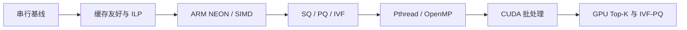
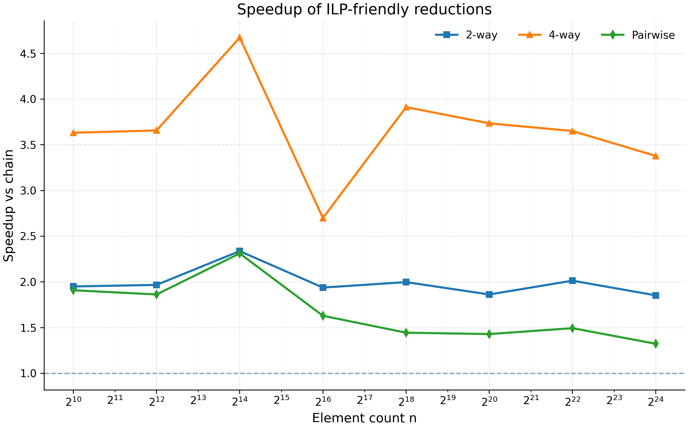
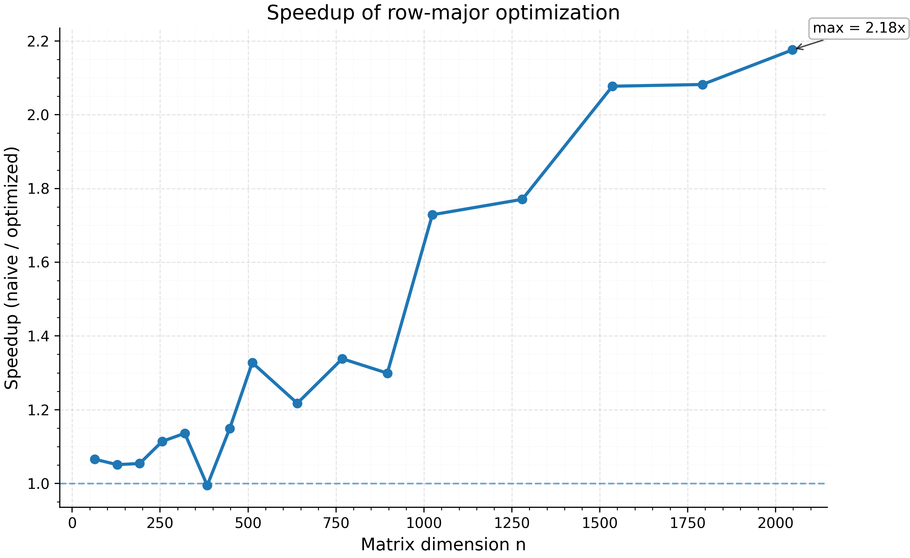

<div align="center">

# NKU Parallel Programming

**2026 南开大学《并行程序设计》课程实验**

从串行访存优化出发，逐步走向 SIMD、多线程与 CUDA 并行的向量检索实验。

<p>
  
  
  
  
  
</p>

[实验概览](#实验概览) · [优化路线](#优化路线) · [结果快照](#结果快照) · [项目结构](#项目结构) · [快速开始](#快速开始)

</div>

---

## 实验概览

本仓库记录南开大学《并行程序设计》课程的阶段性实验。内容不是彼此独立的代码片段，而是一条逐步演进的性能优化路线：先分析访存模式与指令级并行，再将向量检索扩展到 SIMD、线程级并行和 GPU 批处理。

| 实验 | 主题 | 主要内容 | 代表产物 |
| --- | --- | --- | --- |
| [Lab 1](lab1/) | 串行程序优化与性能分析 | 多累加器归约、成对归约、矩阵访存顺序优化、缓存工作集分析 | C++ 基准程序、CSV、Matplotlib 图表、VTune 记录 |
| [Lab 2](lab2/) | SIMD 向量检索 | ARM NEON、循环展开、多累加器、预取、SQ/PQ 粗排与精排 | Flat、SQ、PQ 多版本扫描器与 DEEP100K 测试入口 |
| [Lab 3](lab3/) | 多线程并行检索 | Pthread / OpenMP 下的 Flat、PQ、IVF、IVF-PQ、HNSW 对比 | 按算法和线程模型拆分的实验版本 |
| [Lab 4](lab4/) | 多线程方案阶段性整理 | 延续 ANN 多版本实现，保留阶段性代码与集群运行脚本 | Pthread / OpenMP 版本、PBS 提交脚本 |
| [Lab 5](lab5/) | CUDA 向量检索 | GPU Flat、GPU Top-K、IVF 分组策略、PQ 与 IVF-PQ | CUDA kernels、批量实验脚本、汇总与绘图工具 |

> [!NOTE]
> Lab 2 之后的核心任务是基于 DEEP100K 的近似最近邻检索。仓库同时保留不同优化阶段，便于比较延迟、Recall@10、吞吐和实现复杂度。

## 优化路线



### 核心实践

- **性能测量**：使用确定性输入、自适应重复次数、多轮计时、缓存扰动和结果误差检查，减少偶然波动。
- **数据布局**：通过行优先访问、循环展开、多累加器和预取改善缓存命中率与流水线利用率。
- **向量化**：比较编译器自动向量化与手写 ARM NEON，并探索 `uint8` 量化后的 SIMD 点积。
- **线程并行**：使用 Pthread 与 OpenMP 拆分查询任务，对比 Flat、PQ、IVF、IVF-PQ 和 HNSW 路线。
- **GPU 并行**：实现批量 Flat 检索、GPU Top-K、IVF 候选分组、PQ 编码与 IVF-PQ 搜索。
- **实验工程化**：用 PowerShell 批量扫参，输出主结果与 batch-level CSV，再通过 Python 汇总和绘图。

## 结果快照

以下数字来自仓库已提交的 [Lab 1 CSV](lab1/result/)，用于展示优化趋势，不代表跨硬件平台的固定结论。

| 实验 | 优化方式 | 仓库记录的最高加速比 | 正确性检查 |
| --- | --- | ---: | --- |
| 数组归约 | 四路多累加器 | **4.67x** | 最大绝对误差不超过 `6e-6` |
| 矩阵向量计算 | 列访问改为行优先累加 | **3.65x** | 已提交测试点的 `max_diff` 均为 `0` |

<table>
  <tr>
    <td width="50%" align="center">
      
      <br />
      <sub>多累加器与成对归约加速比</sub>
    </td>
    <td width="50%" align="center">
      
      <br />
      <sub>访存顺序优化后的加速比</sub>
    </td>
  </tr>
</table>

> [!IMPORTANT]
> 性能结果会受到 CPU/GPU 型号、编译器、优化级别、缓存状态和系统负载影响。复现实验时应记录完整环境，并同时报告性能与正确性指标。

## 技术矩阵

| 层级 | 技术与算法 |
| --- | --- |
| 语言 | C++17、CUDA C++、Python、PowerShell、Shell |
| CPU 优化 | Cache-friendly access、ILP、循环展开、预取、ARM NEON |
| 线程模型 | Pthread、OpenMP |
| 检索算法 | Flat、SQ、PQ、IVF、IVF-PQ、HNSW |
| GPU 路线 | 批量点积、CPU/GPU Top-K、候选分组、负载均衡、局部性优化 |
| 实验分析 | CSV、Matplotlib、NumPy、Pandas、VTune notes |
| 集群环境 | PBS / `qsub` 辅助脚本 |

## 项目结构

```text
NKU-ParallelProgramming/
├── lab1/
│   ├── src/                    # 串行优化、基准测试与绘图脚本
│   ├── result/                 # CSV、性能图表与 VTune 记录
│   └── report/                 # 报告素材
├── lab2/                       # ARM NEON、SQ/PQ 与 Flat 检索优化
├── lab3/                       # Pthread / OpenMP 多版本 ANN 实验
├── lab4/                       # 多线程实验的阶段性代码与集群脚本
├── lab5/
│   ├── 02_gpu_flat_searcher.*  # GPU Flat 检索
│   ├── 03_gpu_topk.*           # GPU Top-K
│   ├── 04_ivf_index.*          # IVF 索引
│   ├── 05_gpu_ivf_searcher.*   # GPU IVF 与分组策略
│   ├── 06_pq_index.*           # PQ 索引
│   ├── 07_gpu_ivf_pq_searcher.*# GPU IVF-PQ
│   └── scripts/                # 批量实验、汇总、表格导出与绘图
└── README.md
```

## 快速开始

### 1. 复现 Lab 1

下面以 GCC/Clang 风格命令为例。Windows 用户可将输出文件名改为 `.exe`。

```bash
cd lab1
g++ -O3 -std=c++17 src/sum_reduce.cpp -o sum_reduce
g++ -O3 -std=c++17 src/dot_product.cpp -o dot_product

./sum_reduce result/sum.csv
./dot_product result/dot.csv

python src/plot_lab1_1.py result/dot.csv result/figures
python src/plot_lab1_2.py result/sum.csv result/figures
```

绘图依赖：

```bash
pip install matplotlib numpy pandas
```

### 2. 准备 DEEP100K

仓库不包含数据集。Lab 2 至 Lab 4 默认从 `/anndata/` 读取以下文件，Lab 5 则默认从 `lab5/data/` 读取：

```text
DEEP100K.base.100k.fbin
DEEP100K.query.fbin
DEEP100K.gt.query.100k.top100.bin
```

如需在其他环境运行，请先修改对应 `main.cc` / `main.cpp` 中的数据目录。

### 3. 运行 Lab 2 至 Lab 4

这些实验面向课程提供的 AArch64 / 集群环境，包含 ARM NEON、Pthread、OpenMP 和 PBS 脚本。运行前请确认：

- 编译器支持目标架构及相应 SIMD 指令；
- 编译时启用 OpenMP 或链接 Pthread；
- `/anndata/` 中已放置 DEEP100K 文件；
- 使用集群时已根据账户与节点环境调整 `qsub.sh`。

### 4. 运行 Lab 5

Lab 5 的脚本默认调用 `lab5/ann_gpu.exe`。请先使用本机 CUDA 工具链完成编译，并将数据集放入 `lab5/data/`，随后执行：

```powershell
cd lab5
powershell -ExecutionPolicy Bypass -File .\scripts\run_all.ps1
python .\scripts\summarize_results.py
python .\scripts\plot_report_figures.py
python .\scripts\export_report_tables.py
```

可在 `scripts/run_all.ps1` 中控制基础实验、PQ 全量实验和高级采样实验是否启用。单项脚本支持对 batch size、`nprobe`、分组策略和 PQ 参数进行多轮扫描。

## Lab 5 检索模式

| 类型 | 可用模式示例 |
| --- | --- |
| 基线 | `cpu_flat` |
| GPU Flat | `gpu_flat_cpu_topk`、`gpu_flat_gpu_topk` |
| GPU IVF | `gpu_ivf`、`gpu_ivf_main`、`gpu_ivf_jaccard`、`gpu_ivf_query` |
| IVF 调度 | `gpu_ivf_hybrid`、`gpu_ivf_adaptive`、`gpu_ivf_load_balance`、`gpu_ivf_locality`、`gpu_ivf_hierarchical`、`gpu_ivf_time` |
| GPU IVF-PQ | `gpu_ivf_pq`、`gpu_ivf_pq_main`、`gpu_ivf_pq_jaccard` |

程序统一输出平均 Recall@10 与平均查询延迟，并可将整体结果和 batch-level 统计追加到 CSV。

## 实验记录建议

复现或扩展实验时，建议同时记录：

- CPU/GPU 型号、操作系统、编译器与编译参数；
- 数据规模、向量维度、查询数、batch size 与线程数；
- `nlist`、`nprobe`、PQ 子空间数和码本大小；
- 平均延迟、吞吐、Recall@10、加速比与数值误差；
- 预热方式、重复次数以及结果聚合策略。

## 致谢

部分 ANN 实验使用并保留了 [hnswlib](https://github.com/nmslib/hnswlib) 的源码与许可证。感谢课程教师、助教及相关开源项目提供的实验基础。
